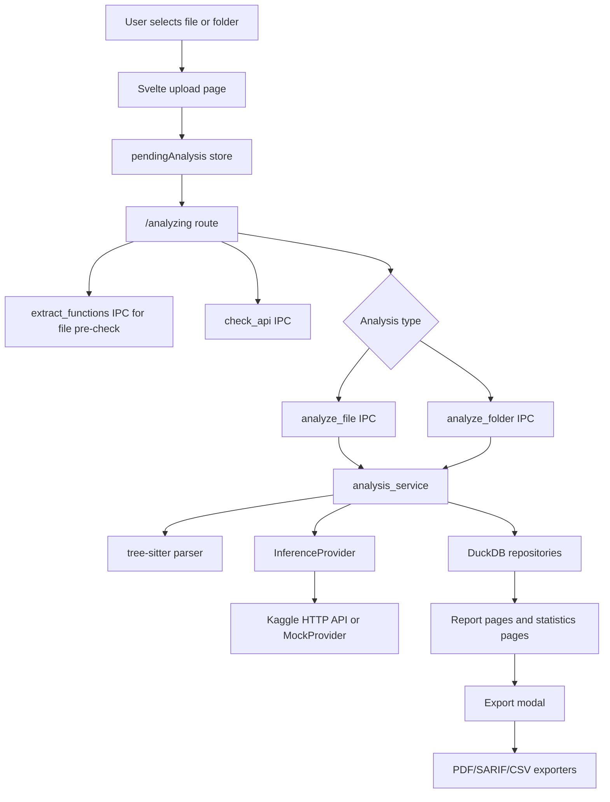
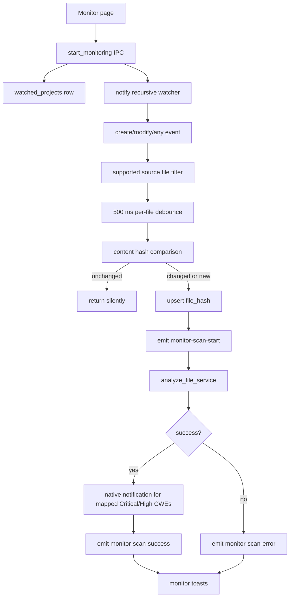

# C-Cure Technical Architecture

This document describes the implementation that is currently present in this repository. It is based on the checked-in source files under `src`, `src-tauri`, `static`, and `test_project`. It intentionally avoids describing features that are not implemented in the code.

## Source Inventory

### Runtime Stack

- Frontend: SvelteKit with Svelte 5, TypeScript, Tailwind CSS, Chart.js, lucide-svelte icons, Bits UI primitives, highlight.js, and OGL.
- Desktop shell: Tauri v2.
- Backend: Rust 2021, Tokio, async DuckDB, tree-sitter C++ parsing, reqwest HTTP calls, notify file watching, genpdf PDF generation, SARIF and CSV exporters.
- Persistence: DuckDB stored as `ccure.db` in the Tauri app data directory.
- Inference: remote HTTP inference provider configured by the app setting named `kaggle_url`, plus a mock provider selected by the `MOCK_API=true` environment variable.
- Python: no `.py` files are currently checked into the repository. The current executable implementation is Rust plus TypeScript/Svelte.

### Top-Level Project Layout

- `src/`: SvelteKit frontend.
- `src/lib/components/`: shared Svelte components. `ExportReportModal.svelte` is used by report pages; `ui/*` contains primitive UI components and the WebGL background component.
- `src/lib/data/cwe-reference.ts`: frontend CWE, CVSS, scenario, and mitigation reference data.
- `src/lib/stores/`: Svelte stores for pending analysis, a class-based analysis flow, and total vulnerability count.
- `src/lib/styles/`: CSS variables, component classes, button classes, and background utilities.
- `src/lib/types/`: frontend TypeScript interfaces and theme store.
- `src/lib/utils/`: class-name helper and toast store.
- `src/routes/`: application pages and route-local logic modules.
- `src-tauri/`: Tauri and Rust backend.
- `src-tauri/src/commands.rs`: full Tauri IPC command surface.
- `src-tauri/src/db/`: DuckDB schema, repositories, statistics, watched projects, compliance mappings, and migration logic.
- `src-tauri/src/inference/`: inference trait, Kaggle HTTP provider, mock provider, config file helpers, and concurrent dispatcher.
- `src-tauri/src/services/analysis_service.rs`: orchestration for manual and monitor-triggered analysis.
- `src-tauri/src/parser.rs`: tree-sitter C++ function extraction and source cleanup.

- `src-tauri/src/monitor_service.rs`: active watcher registry, debounced file-change analysis, Tauri events, and native notifications.
- `src-tauri/src/exports/`: PDF, SARIF, and CSV export implementations.
- `src-tauri/src/bin/`: standalone seeding and benchmark utilities.
- `static/`: logos, favicon, framework SVGs, and static font files.
- `test_project/`: sample C/C++ source corpus with annotated vulnerable and clean functions.

### Build And Run Configuration

- `package.json` scripts:
  - `npm run dev`: Vite dev server.
  - `npm run build`: static SvelteKit build.
  - `npm run preview`: Vite preview.
  - `npm run check`: `svelte-kit sync` plus `svelte-check`.
  - `npm run tauri`: Tauri CLI passthrough.
- `src-tauri/tauri.conf.json`:
  - Product name: `c-cure-demo`.
  - Version: `0.1.0`.
  - Identifier: `fcis`.
  - Dev URL: `http://localhost:1420`.
  - Frontend build output: `../build`.
  - Main window title: `c-cure-demo`.
  - Main window size: 800x600.
  - CSP: `null`.
  - Bundle targets: `all`.
- `svelte.config.js` uses `@sveltejs/adapter-static` with `fallback: "index.html"`.
- `src/routes/+layout.ts` sets `ssr = false`, so the frontend runs as a single page app.
- `vite.config.js`:
  - Uses `sveltekit()`.
  - Keeps a strict dev-server port of `1420`.
  - Supports `TAURI_DEV_HOST` for host and HMR settings.
  - Ignores `src-tauri` in Vite file watching.
- `tailwind.config.ts`:
  - Uses class-based dark mode.
  - Scans `./src/**/*.{html,js,svelte,ts}`.
  - Extends an `accent` color group.

## High-Level Runtime Architecture

The application is a desktop SPA hosted by Tauri. The frontend owns navigation, form state, display state, charts, filters, toasts, and modal interactions. It calls Rust through Tauri IPC commands. The Rust backend owns file I/O, parsing, remote inference, DuckDB persistence, report aggregation, file watching, native OS notifications, and export writing.

The main data path is:

1. The user selects a file or folder in the Svelte frontend.
2. The frontend stores `{ type, path }` in `pendingAnalysis`.
3. The frontend navigates to `/analyzing`.
4. `/analyzing` optionally pre-checks single-file function extraction.
5. `/analyzing` checks inference API reachability.
6. `/analyzing` invokes either `analyze_file` or `analyze_folder`.
7. Rust extracts functions with tree-sitter.
8. Rust dispatches extracted function bodies to an inference provider.
9. Rust saves the analysis, files, and functions to DuckDB.
10. Rust returns summary counters and function results.
11. The frontend clears the pending store and navigates to `/report/{analysis_id}`.
12. Report pages query summary and paginated function data from DuckDB through IPC commands.

The monitor data path is separate:

1. The user registers a folder through `/monitor`.
2. Rust persists the watched project and starts a recursive `notify` watcher.
3. On supported file create/modify events, Rust debounces events per path for 500 ms.
4. Rust hashes changed file content and compares it with the stored file hash.
5. If content changed or no hash exists, Rust stores the new hash before scanning.
6. Rust emits `monitor-scan-start`.
7. Rust reuses `analyze_file_service`.
8. Rust emits `monitor-scan-success` or `monitor-scan-error`.
9. Rust sends a native OS notification only for the alert CWE set implemented in `monitor_service.rs`.
10. The monitor page listens for those Tauri events and shows toasts.

## Frontend Architecture

### SPA Shell And Layout

`src/routes/+layout.svelte` imports global CSS from `src/app.css`, uses `$app/stores` for route detection, imports `theme` from `src/lib/types/theme.ts`, and renders the persistent navigation and toast host.

Navigation links:

- `/`: label `Upload`, icon `Upload`.
- `/statistics`: label `Statistics`, icon `BarChart3`.
- `/history`: label `History`, icon `Clock`.
- `/monitor`: label `Monitor`, icon `Radio`.
- `/settings`: separate settings link, icon `Settings`.

The layout chooses `/logo-white.png` or `/logo-black.png` based on `$theme`. Toasts come from the writable `toasts` store. Each toast renders in a fixed bottom-right stack with one of three visual styles:

- `success`: green background and check symbol.
- `error`: red background and cross symbol.
- `info`: surface background and info symbol.

### Theme Store

`src/lib/types/theme.ts` owns the theme store.

- It reads `localStorage.getItem("theme")`, defaulting to `dark`.
- It exports `theme` as a Svelte writable store of type `"dark" | "light"`.
- On every subscription update, it writes the new value back to `localStorage`.
- It toggles `dark` and `light` classes on `document.documentElement`.
- `src/lib/styles/theme.css` defines CSS variables for `:root` and overrides them in `html.light`.

### Global CSS System

`src/app.css` imports Tailwind layers, Google Fonts, and local CSS modules.

Imported local CSS:

- `theme.css`: design tokens, base styles, scrollbars, animations, status dots, skeleton shimmer.
- `components.css`: `.card`, `.nav-link`, `.input`, `.table-row`, gradient helpers.
- `buttons.css`: `.btn-primary`, `.btn-ghost`, `.animated-button`.
- `backgrounds.css`: `.bg-grid`, `.aurora-bg`, light-mode aurora overrides, aurora keyframes.

The app uses CSS variables heavily in route markup. Many pages directly compose Tailwind utility classes with inline `style="color:var(...)"` and `style="background:var(...)"` rather than consistently using the primitive UI components.

### Shared Utilities

`src/lib/utils/index.ts` exports `cn(...inputs)`:

- Accepts strings, numbers, bigints, booleans, null, undefined, nested arrays, and object maps.
- Recursively flattens class values.
- Includes object keys only when their value is truthy.
- Joins final classes with spaces.

`src/lib/utils/toast.ts` exports:

- `toasts`: writable array of `{ id, message, type }`.
- `toast(message, type = "info", duration = 3000)`.
- `success(msg)`.
- `error(msg)`, duration 4000 ms.
- `info(msg)`.

The toast store increments a module-level `counter` for IDs and removes each toast after its timeout.

### Shared UI Components

`src/lib/components/ui/Button.svelte`:

- Wraps `bits-ui` `ButtonPrimitive.Root`.
- Uses Svelte 5 `$props`.
- Props: `variant` (`primary`, `outline`, `ghost`), `size` (`sm`, `md`, `lg`), `children`, plus HTML button attributes.
- Uses `cn` to combine base classes, variant classes, size classes, and custom class.

`src/lib/components/ui/Badge.svelte`:

- Props: `variant`, `children`, span HTML attributes.
- Variants include `default`, `safe`, `vulnerable`, `severity-low`, `severity-medium`, `severity-high`, and `outline`.

`src/lib/components/ui/Card.svelte`:

- Props: `title`, `description`, `footer`, `children`, HTML div attributes.
- Renders optional header, child content, and optional footer.

`src/lib/components/ui/Progress.svelte`:

- Wraps `bits-ui` progress primitive.
- Props: `value`, `max`, `class`, `indicatorClass`.
- Indicator position is controlled by a translateX transform based on value/max.

`src/lib/components/ui/FaultyTerminal.svelte`:

- Used by the upload page as a full-page WebGL background layer.
- Uses OGL `Renderer`, `Program`, `Mesh`, `Color`, and `Triangle`.
- Accepts many `$props` controlling scale, grid, digit size, time scale, scanlines, glitching, flicker, noise, chromatic aberration, dither, curvature, tint, mouse reaction, device pixel ratio, page-load animation, brightness, class, and style.
- Defines a full-screen triangle shader program.
- Fragment shader creates animated digit/noise patterns with coral/sand/pink gradient coloring and transparent alpha based on pixel intensity.
- On mount:
  - Creates an alpha-enabled OGL renderer.
  - Appends the WebGL canvas to the bound container.
  - Uses `ResizeObserver` to keep the renderer sized to the container.
  - Starts a `requestAnimationFrame` loop.
  - Optionally tracks global mouse movement.
  - Updates shader uniforms for time, mouse, page-load progress, and derived props.
- On unmount:
  - Cancels the animation frame.
  - Disconnects the resize observer.
  - Removes the mouse listener.
  - Removes the canvas.
  - Attempts to lose the WebGL context.

### Upload Page: `/`

Files:

- `src/routes/+page.svelte`
- `src/routes/logic.ts`
- `src/lib/stores/store.ts`

State in `+page.svelte`:

- `selectedPath: string | null`
- `selectedName: string`
- `selectionType: "file" | "folder" | null`
- `errorMessage: string`

The page renders:

- Theme-aware full-page background.
- `FaultyTerminal` under the content.
- Grid overlay and radial glow.
- Logo.
- Two selection buttons:
  - Single file scan.
  - Project folder scan.
- Selected target panel.
- Error panel.
- Initiate scan button.
- History link.

`handleFilePick` in `src/routes/logic.ts`:

- Dynamically imports `open` from `@tauri-apps/plugin-dialog`.
- Opens a file picker with `multiple: false`, `directory: false`.
- Filters to extensions `cpp`, `c`, `h`, `cc`, `cxx`.
- Extracts the file name by normalizing backslashes to slashes and taking the final segment.
- Calls success or error callbacks supplied by the page.

`handleFolderPick`:

- Opens a directory picker with `multiple: false`, `directory: true`.
- Extracts folder name the same way.

`handleAnalyze`:

- Writes `{ type, path }` to `pendingAnalysis`.
- Navigates to `/analyzing`.

`pendingAnalysis` is a Svelte writable store containing either:

```ts
{ type: "file" | "folder"; path: string }
```

or `null`.

### Analyzing Page: `/analyzing`

Files:

- `src/routes/analyzing/+page.svelte`
- `src/routes/analyzing/logic.ts`

The active analysis flow is route-local.

Route-local state:

- `currentStep`
- `progress`
- `errorMessage`
- `showSummary`
- `summaryData`

`STEPS`:

1. `Reading source file`
2. `Extracting functions`
3. `Connecting to inference API`
4. `Running triage + classification`
5. `Generating report`

`runAnalysis` behavior:

1. Reads `pendingAnalysis` through `get(pendingAnalysis)`.
2. If there is no pending target, navigates back to `/`.
3. Sets step 0 and waits 350 ms.
4. Sets step 1.
5. For single-file scans only, invokes `extract_functions` with `{ filePath: pending.path }`.
6. If `extract_functions` returns `count === 0`, reports an error and stops.
7. Folder scans skip the pre-check and rely on backend extraction.
8. Sets step 2.
9. Invokes `check_api`.
10. If `reachable` is false, reports an error and stops.
11. Sets step 3.
12. Invokes either:
    - `analyze_file` with `{ filePath: pending.path }`
    - `analyze_folder` with `{ folderPath: pending.path }`
13. Sets step 4.
14. Waits 350 ms.
15. Clears `pendingAnalysis`.
16. Shows summary data.
17. After 2500 ms, navigates to `/report/{result.analysis_id}`.

The analyzing page expects runtime result fields in snake_case, such as `analysis_id`, `project_name`, `total_functions`, and `vuln_count`.

### History Page: `/history`

Files:

- `src/routes/history/+page.svelte`
- `src/routes/history/logic.ts`

State:

- `history: any[]`
- `loading`
- `deleting: Record<number, boolean>`
- `confirmId: number | null`
- `searchTerm`

Derived state:

- `filteredHistory`: filters loaded history by `project_name`, case-insensitive.

On mount:

- Calls `loadHistory()`.
- `loadHistory()` invokes `get_history`.
- On error, `loadHistory()` shows an error toast and returns an empty array.

Delete flow:

1. User presses trash button.
2. `confirmId` is set, causing an inline confirmation row.
3. Confirming sets `deleting[id] = true`.
4. `deleteAnalysis(id)` invokes `delete_analysis` with `{ analysisId: id }`.
5. On success, the page filters the item out of local `history`.
6. Toasts show success or failure.

The page renders loading skeletons, empty state, filtered-empty state, and a table of analyses.

### Statistics Page: `/statistics`

File: `src/routes/statistics/+page.svelte`

Libraries:

- `Chart` and `registerables` from Chart.js.
- `theme` store for chart colors.

State:

- `stats`
- `trendData`
- `loading`
- `error`
- `displayKpis`
- Chart instances: `cweChart`, `severityChart`, `fileChart`, `trendChart`
- Canvas refs for each chart.
- `allAnalyses`
- `selectedAnalysis: "all" | number`
- `selectedFileRatios`

On mount:

1. Invokes `get_statistics`.
2. Expects response shape `{ dashboard, trend }`.
3. Stores `stats = data.dashboard`.
4. Stores `trendData = data.trend ?? []`.
5. Builds `allAnalyses` from `stats.recent_analyses`.
6. Initializes `selectedFileRatios` from top 10 `stats.file_ratios`, sorted by vulnerable count.
7. Sets `loading = false`.
8. After 50 ms, calls `drawCharts()` and animates KPI values with `animateCountUp(stats.kpis)`.

The page contains a reactive statement:

```svelte
$: if (stats && !loading) handleSelectionChange(selectedAnalysis);
```

`handleSelectionChange("all")`:

- Uses `stats.file_ratios`.
- Sorts by vulnerable count.
- Takes top 10.
- Redraws the file chart.

`handleSelectionChange(number)`:

- Invokes `get_report` for the selected analysis.
- Builds per-file safe/vulnerable counts from `report.files[*].functions`.
- Sorts by vulnerable count and takes top 10.
- Redraws the file chart.

Charts:

- CWE breakdown: horizontal bar chart, labels `${cwe} - ${cwe_name}` in the code as a rendered dash-like character from source text, data from `stats.cwe_counts`.
- Severity distribution: doughnut chart from `stats.severity_counts`.
- File ratios: stacked bar chart from `selectedFileRatios`.
- Trend: line chart from `trendData`, label derived from the date portion of `timestamp`.

### Monitor Page: `/monitor`

File: `src/routes/monitor/+page.svelte`

State:

- `monitoredFolders: MonitoredFolder[]`
- `loading`
- `actionPath: string | null`
- `error`
- `hasMonitoredPaths`: derived from `monitoredFolders.length > 0`

`MonitoredFolder` shape:

- `id`
- `name`
- `path`
- `registeredAt`
- `active`

On mount:

1. Calls `loadMonitoredPaths()`.
2. Registers listeners for:
   - `monitor-scan-start`
   - `monitor-scan-success`
   - `monitor-scan-error`
3. Cleans up listeners on component unmount.

`loadMonitoredPaths()`:

1. Invokes `monitor_list`.
2. Invokes `get_monitored_paths`.
3. Normalizes active paths to lowercase slash-normalized strings.
4. Maps DB projects into UI folders and marks active if the project path is in the active watcher set.

`handleAddFolder()`:

1. Opens a directory picker.
2. If a folder string is returned, sets `actionPath`.
3. Invokes `start_monitoring` with `{ path: folder }`.
4. Reloads monitored paths.

`handleStop(path)`:

1. Sets `actionPath = path`.
2. Invokes `stop_monitoring` with `{ path }`.
3. Reloads monitored paths.

Tauri event toasts:

- `monitor-scan-start`: info toast with changed file name.
- `monitor-scan-success`: error toast if `vuln_count > 0`, success toast otherwise.
- `monitor-scan-error`: error toast with backend error text.

### Settings Page: `/settings`

Files:

- `src/routes/settings/+page.svelte`
- `src/routes/settings/logic.ts`

State:

- `kaggleUrl`
- `saving`
- `loading`

On mount:

- Calls `loadSettings()`.
- `loadSettings()` invokes `get_settings`.
- Sets `kaggleUrl = s.kaggle_url ?? ""`.

Save flow:

- `handleSave()` sets `saving`, calls `saveSettings(kaggleUrl)`, then clears `saving`.
- `saveSettings()` invokes `save_settings` with `{ kaggleUrl }`.
- Success and failure are shown through toasts.

Theme flow:

- `toggleTheme()` updates the shared `theme` store between `dark` and `light`.

The About card displays `C-Cure - v0.1.0 - Demo - FCIS Graduation Project 2026` and supervision text. This version string is UI text only; `package.json` and `tauri.conf.json` both use `0.1.0`.

### Report Summary Page: `/report/[id]`

Files:

- `src/routes/report/[id]/+page.svelte`
- `src/routes/report/[id]/logic.ts`

State:

- `report`
- `error`
- `loading`
- `mounted`
- `exportModalOpen`

On mount:

1. Calls `fetchAnalysisSummary($page.params.id ?? "0")`.
2. `fetchAnalysisSummary` invokes `get_analysis_summary` with parsed `analysisId`.
3. Stores the summary in `report`.
4. Sets `loading = false`.
5. After 80 ms, sets `mounted = true` for ring animation.

Derived summary values:

- `totalFunctions`
- `vulnerableFunctions`
- `cleanFunctions`
- `totalFiles`
- `vulnPct`
- `isFolder`
- `severityCounts`
- `maxSevCount`
- `cweFrequency`
- `topFindings`
- `ringColor`
- `ringOffset`

The page renders:

- Header with back link to history, project name, timestamp, export button, and full-report link.
- Vulnerability percentage ring.
- KPI cards.
- Severity bars.
- Top vulnerability frequency list.
- Most critical findings list, limited by backend query.
- CTA link to full report.
- `ExportReportModal`.

The page uses runtime snake_case fields from Rust, including `project_name`, `total_functions`, `vulnerable_functions`, `clean_functions`, `severity_breakdown`, `top_vulnerabilities`, and `most_critical_findings`.

### Report Detail Page: `/report/[id]/detail`

File: `src/routes/report/[id]/detail/+page.svelte`

The detail page is paginated. It never fetches the complete report for the main function list.

Local types:

- `FunctionRow`: snake_case runtime fields returned by Rust.
- `PagedFunctions`: `{ total, limit, offset, functions }`.

State:

- `error`
- `loading`
- `isLoading`
- `exportModalOpen`
- `currentPage`
- `pageSize`, initialized to 50.
- `totalCount`
- `pagedFunctions`
- `expandedIds: Set<number>`
- `expandedFiles: Set<string>`
- `copiedId`
- `searchTerm`
- `filterVerdict: "all" | "vulnerable" | "safe"`
- `sortBy: "severity" | "name" | "line"`
- `viewMode: "function" | "file"`

Derived values:

- `totalPages`
- `pageStart`
- `pageEnd`
- `groupedByFile`
- `isFolder`
- `codeBg`

On mount:

1. Parses `analysisId` from route params.
2. Calls `loadPage(1)`.
3. Clears `loading`.

`loadPage(pageNumber)`:

1. Sets `isLoading = true`.
2. Clears expanded function IDs.
3. Invokes `search_functions` with `analysisId`, the current `searchTerm`, `filterVerdict`, `sortBy`, `limit: pageSize`, and `offset: (pageNumber - 1) * pageSize`.
4. Sets `pagedFunctions = result.functions` and `totalCount` from the returned filtered total.
5. Sets `currentPage`.
6. Scrolls window to top smoothly.
7. Clears `isLoading`.

Changing `searchTerm` (debounced ~300ms), `filterVerdict`, or `sortBy` resets `currentPage` to 1 and re-invokes `loadPage`.

Filtering and sorting:

- Search and verdict filters operate across the entire analysis on the backend.
- Search checks function name, CWE, CWE name, and file path.
- Severity sort orders `Critical`, `High`, `Medium`, `Low`, then unknown.
- Name sort uses `localeCompare`.
- Line sort uses `start_line ?? 0`.

Folder view:

- `groupedByFile` groups the current filtered page slice by `file_path`.
- `isFolder` is true only when the current filtered page slice contains more than one file path.
- The by-file view toggle is shown only if `isFolder` is true.

Code display:

- `highlightCode()` from `src/routes/report/[id]/logic.ts` uses highlight.js with the C++ language registered.
- The page injects a highlight.js stylesheet from `https://cdnjs.cloudflare.com/ajax/libs/highlight.js/11.9.0/styles/atom-one-dark.min.css` or `atom-one-light.min.css` in `<svelte:head>`, based on `$theme`.
- Line numbers are generated from `start_line` plus the local line index.
- Copy uses `navigator.clipboard.writeText`.

CWE enrichment:

- `getCWEData(fn.cwe)` reads static frontend data from `src/lib/data/cwe-reference.ts`.
- The function view includes logic to parse `fn.cwe` as JSON if it starts with `[`, then renders one panel per CWE code. The by-file expanded panel handles only a single `fn.cwe` string.
- CVSS score, CVSS vector, attack scenario, and mitigations come from frontend static data.
- Compliance badges come from backend-returned `asvs_id`.

### Export Modal

File: `src/lib/components/ExportReportModal.svelte`

Props:

- `analysisId: string`
- `open: boolean`
- `onClose: () => void`

Formats:

- `pdf_technical`: extension `pdf`.
- `pdf_executive`: extension `pdf`.
- `sarif`: extension `sarif`.
- `csv`: extension `csv`.

State:

- `selectedFormat`
- `selectedPath`
- `isExporting`
- `errorMessage`
- `previousFormat`
- `selectedOption`

Behavior:

- Changing format clears `selectedPath` and `errorMessage`.
- `defaultFileName()` returns `c-cure-{tier}-report-{analysisId}.{extension}`.
- `withExpectedExtension()` appends the expected extension if missing.
- `choosePath()` dynamically imports `save` from `@tauri-apps/plugin-dialog` and opens a native save dialog.
- `runExport()` chooses a path if one is not already selected, then invokes `export_report`.

IPC payload:

```ts
{
  analysisId: parseInt(analysisId),
  format: selectedFormat,
  filePath: targetPath,
  executiveSummaryOnly: selectedFormat === "pdf_executive"
}
```

On success, it shows a success toast, clears `selectedPath`, and closes the modal. On failure, it stores and toasts an error message.

### Frontend Type Definitions

File: `src/lib/types/bindings.ts`

This file defines TypeScript interfaces for reports, functions, dashboard data, monitor data, and command responses. Most interfaces use camelCase property names, for example `projectName`, `totalFunctions`, `analysisId`, and `folderPath`.

The Rust backend currently serializes most structs with snake_case field names because the structs do not use serde `rename_all = "camelCase"`. Many active route files therefore use `any` and snake_case field access. `ExportSettings` in Rust is an exception: it uses `#[serde(default, rename_all = "camelCase")]`.

### Frontend CWE Reference Data

File: `src/lib/data/cwe-reference.ts`

This is static bundled data, not a database. The frontend never accesses a database directly; all persisted data goes through backend IPC.

Implemented CWE entries:

- `CWE-125`: Out-of-bounds Read, CVSS 9.1, frontend CVSS severity `Critical`.
- `CWE-787`: Out-of-bounds Write, CVSS 9.8, frontend CVSS severity `Critical`.
- `CWE-190`: Integer Overflow or Wraparound, CVSS 8.6, frontend CVSS severity `High`.
- `CWE-369`: Divide By Zero, CVSS 7.5, frontend CVSS severity `High`.
- `CWE-415`: Double Free, CVSS 8.1, frontend CVSS severity `High`.
- `CWE-476`: NULL Pointer Dereference, CVSS 7.5, frontend CVSS severity `High`.
- `CWE-79`: Cross-Site Scripting, CVSS 6.1, frontend CVSS severity `Medium`.
- `CWE-89`: SQL Injection, CVSS 9.8, frontend CVSS severity `Critical`.

Each entry includes:

- `name`
- `description`
- `scenario`
- `mitigations`
- `cvss_vector`
- `cvss_score`
- `cvss_severity`

Helper functions:

- `getCWEData(cwe)`
- `getCVSSColor(score)`
- `getSeverityBorderColor(severity)`
- `getSeverityGlow(severity)`

## Backend Architecture

### Tauri Entrypoint

Files:

- `src-tauri/src/main.rs`
- `src-tauri/src/lib.rs`

`main.rs` disables the extra console window in Windows release builds and calls `c_cure_demo_lib::run()`.

`lib.rs` defines modules and `AppState`.

`AppState` fields:

- `pool: db::DbPool`
- `reqwest_client: reqwest::Client`
- `app_data_dir: PathBuf`
- `watchers: monitor_service::WatcherRegistry`

Startup sequence in `run()`:

1. Creates a Tauri builder.
2. In setup, obtains `app_data_dir` from Tauri path APIs, falling back to `.`.
3. Computes an old DB path next to the executable: `backend/ccure.db`.
4. Calls `db::create_pool(&app_data_dir, old_db_path.as_deref())`.
5. Builds a reqwest client with `danger_accept_invalid_certs(true)`.
6. Creates a watcher registry with `monitor_service::new_registry()`.
7. Calls `monitor_service::restore_watchers(...)` synchronously through Tauri async runtime.
8. Manages `AppState`.
9. Registers plugins:
   - `tauri-plugin-notification`
   - `tauri-plugin-dialog`
   - `tauri-plugin-opener`
10. Registers all commands with `tauri::generate_handler!`.
11. Runs the Tauri application.

The reqwest client accepts invalid TLS certificates. The code comment says this is for local Kaggle ngrok.

### Tauri Capabilities

File: `src-tauri/capabilities/default.json`

The main window has permissions:

- `core:default`
- `opener:default`
- `dialog:default`
- `notification:default`

### IPC Command Surface

File: `src-tauri/src/commands.rs`

Registered commands:

| Command | Rust function | Main responsibility | Used by current frontend |
|---|---|---|---|
| `analyze_file` | `analyze_file` | Load settings URL, run single-file analysis service | Yes |
| `analyze_folder` | `analyze_folder` | Load settings URL, run folder analysis service | Yes |
| `get_history` | `get_history` | Return all analyses with totals | Yes |
| `get_analysis_summary` | `get_analysis_summary` | Return summary metrics, top CWEs, most critical findings | Yes |
| `get_report` | `get_report` | Return full nested report with all functions | Yes, statistics dropdown |
| `delete_analysis` | `delete_analysis` | Delete analysis, files, and functions | Yes |
| `get_functions_count` | `get_functions_count` | Return total function rows for analysis | Yes |
| `get_functions_page` | `get_functions_page` | Return paginated flat function rows | Yes |
| `search_functions` | `search_functions` | Return full-analysis filtered and sorted function rows | Yes |
| `get_statistics` | `get_statistics` | Return dashboard and trend data | Yes |
| `extract_functions` | `extract_functions` | Parse functions from one file | Yes |
| `check_api` | `check_api` | Check inference provider health | Yes |
| `get_settings` | `get_settings` | Return `kaggle_url` | Yes |
| `save_settings` | `save_settings` | Persist `kaggle_url` | Yes |
| `generate_pdf` | `generate_pdf` | Generate temp PDF and return path | Registered, not used by current frontend |
| `export_report` | `export_report` | Unified PDF/SARIF/CSV export | Yes |
| `export_sarif` | `export_sarif` | Direct SARIF export | Registered, not used by current frontend |
| `export_csv` | `export_csv` | Direct CSV export | Registered, not used by current frontend |
| `monitor_list` | `monitor_list` | List watched projects from DB | Yes |
| `start_monitoring` | `start_monitoring` | Persist watched project and start active watcher | Yes |
| `stop_monitoring` | `stop_monitoring` | Stop active watcher and unregister project | Yes |
| `get_monitored_paths` | `get_monitored_paths` | Return active in-memory watcher paths | Yes |

All command errors use `AppError`, which serializes to a string for IPC.

### Error Type

File: `src-tauri/src/error.rs`

`AppError` variants:

- `Database(duckdb::Error)`
- `AsyncDb(async_duckdb::Error)`
- `Network(reqwest::Error)`
- `Io(std::io::Error)`
- `Service(String)`
- `Custom(String)`

It implements:

- `serde::Serialize` by serializing `self.to_string()`.
- `From<String>`.
- `From<&str>`.
- `From<anyhow::Error>`, mapped to `Service(format!("{:#}", e))`.

### Database Pool And Schema

File: `src-tauri/src/db/mod.rs`

`DbPool` wraps an `async_duckdb::Client`.

`DbPool::with_conn`:

- Takes a blocking closure over `&duckdb::Connection`.
- Runs it with `self.0.conn(f).await`.
- Converts async DuckDB errors into `AppError`.

Database file:

- Normal path: `{app_data_dir}/ccure.db`.
- Migration marker: `{app_data_dir}/.duckdb_migrated`.

Startup migration behavior:

1. Ensures `app_data_dir` exists.
2. If `ccure.db` does not exist and old executable-adjacent `backend/ccure.db` exists, copies the old DB into app data.
3. Detects SQLite files by checking the first 16 bytes for `SQLite format 3\0`.
4. If `ccure.db` is SQLite and marker is missing:
   - Renames `ccure.db` to `ccure.db.pre-migrate.sqlite`.
   - Opens a new DuckDB `ccure.db`.
   - Initializes schema.
   - Runs `INSTALL sqlite; LOAD sqlite;`.
   - Attaches the old SQLite DB as `legacy`.
   - Inserts all rows from legacy tables into DuckDB tables.
   - Resets sequences to current max IDs.
   - Renames pre-migration file to `ccure.db.sqlite.bak`.
   - Writes `.duckdb_migrated`.
5. If no SQLite migration is needed:
   - Opens DuckDB.
   - Initializes schema.
   - Writes migration marker for fresh DuckDB files when appropriate.

The schema creates these sequences:

- `seq_analyses`
- `seq_files`
- `seq_functions`
- `seq_watched_projects`
- `seq_file_hashes`

Tables:

`analyses`

- `id INTEGER PRIMARY KEY DEFAULT nextval('seq_analyses')`
- `timestamp TIMESTAMP DEFAULT CURRENT_TIMESTAMP`
- `project_name VARCHAR NOT NULL`
- `project_path VARCHAR`

`files`

- `id INTEGER PRIMARY KEY DEFAULT nextval('seq_files')`
- `analysis_id INTEGER NOT NULL`
- `file_path VARCHAR NOT NULL`
- Foreign key to `analyses(id)`

`functions`

- `id INTEGER PRIMARY KEY DEFAULT nextval('seq_functions')`
- `file_id INTEGER NOT NULL`
- `function_name VARCHAR NOT NULL`
- `code VARCHAR NOT NULL`
- `verdict VARCHAR NOT NULL`
- `cwe VARCHAR`
- `cwe_name VARCHAR`
- `severity VARCHAR`
- `confidence DOUBLE`
- `start_line INTEGER`
- `end_line INTEGER`
- Foreign key to `files(id)`

`watched_projects`

- `id INTEGER PRIMARY KEY DEFAULT nextval('seq_watched_projects')`
- `name VARCHAR NOT NULL`
- `folder_path VARCHAR NOT NULL UNIQUE`
- `registered_at TIMESTAMP DEFAULT CURRENT_TIMESTAMP`

`file_hashes`

- `id INTEGER PRIMARY KEY DEFAULT nextval('seq_file_hashes')`
- `project_id INTEGER NOT NULL`
- `file_path VARCHAR NOT NULL`
- `file_hash VARCHAR NOT NULL`
- `hashed_at TIMESTAMP DEFAULT CURRENT_TIMESTAMP`
- Unique key on `(project_id, file_path)`
- Foreign key to `watched_projects(id)`

Indexes:

- `idx_files_analysis_id` on `files(analysis_id)`
- `idx_functions_file_id` on `functions(file_id)`
- `idx_functions_verdict` on `functions(verdict)`
- `idx_functions_file_verdict` on `functions(file_id, verdict)`
- `idx_file_hashes_project` on `file_hashes(project_id)`

DuckDB foreign keys exist in table definitions, but delete operations in repositories manually delete children because the code comments state DuckDB does not support `ON DELETE CASCADE`.

### Database Data Transfer Structs

Defined in `src-tauri/src/db/mod.rs`:

- `AnalysisListItem`
- `AnalysisSummary`
- `Report`
- `VulnerabilityReport`
- `FileData`
- `FunctionData`
- `FunctionRow`
- `PagedFunctions`
- `DashboardStats`
- `TrendData`
- `StatisticsData`
- `Kpis`
- `CweCount`
- `SeverityCount`
- `FileRatio`
- `CweHit`
- `WatchedProject`

`FunctionData` fields:

- `id: Option<i32>`, skipped on deserialization.
- `function_name: String`, also accepts deserialization alias `name`.
- `code: String`
- `verdict: String`
- `cwe: Option<String>`
- `cwe_name: Option<String>`
- `asvs_id: Option<String>`
- `severity: Option<String>`
- `confidence: Option<f64>`
- `start_line: Option<i32>`
- `end_line: Option<i32>`

`FunctionRow` is a flat function row plus `file_path`.

`PagedFunctions` returns:

- `total`
- `limit`
- `offset`
- `functions`

### Compliance Mapping

`compliance_for_cwe(cwe)` maps:

- `CWE-125`: ASVS `ASVS 4.0.3 V5.4.1`.
- `CWE-787`: ASVS `ASVS 4.0.3 V5.4.1`.
- `CWE-190`: ASVS `ASVS 4.0.3 V5.4.3`.
- `CWE-369`: ASVS `ASVS 4.0.3 V5.1.4`.
- `CWE-415`: ASVS `ASVS 4.0.3 V5.4.1`.
- `CWE-476`: ASVS `ASVS 4.0.3 V5.4.1`.
- `CWE-79`: ASVS `ASVS 4.0.3 V5.3.3`.
- `CWE-89`: ASVS `ASVS 4.0.3 V5.3.4`.

`FunctionData::with_compliance`, `FunctionRow::with_compliance`, and `CweHit::with_compliance` populate `asvs_id` from the CWE field.

### Analysis Repository

File: `src-tauri/src/db/analysis_repo.rs`

`save_analysis(pool, project_name, project_path)`:

- Inserts into `analyses`.
- Returns generated ID.

`delete_analysis(pool, analysis_id)`:

1. Deletes `functions` whose file belongs to the analysis.
2. Deletes `files` for the analysis.
3. Deletes the `analyses` row.

`get_all_analyses(pool)`:

- Left joins `analyses`, `files`, and `functions`.
- Groups by analysis metadata.
- Returns total function count and vulnerable function count.
- Orders by timestamp descending.

`get_analysis_summary(pool, analysis_id)`:

- Returns one `AnalysisSummary` or `None`.
- Computes:
  - `total_files`
  - `total_functions`
  - `vulnerable_functions`
  - `clean_functions`
- Builds `severity_breakdown` for vulnerable functions with non-null severity.
- Builds `top_vulnerabilities`, grouped by `cwe`, `cwe_name`, and `severity`, ordered by count desc, limited to 5.
- Builds `most_critical_findings`, limited to 5, ordered by severity weight descending, confidence descending nulls last, and function ID ascending.
- Adds compliance IDs to CWE hits and function rows.

Severity ordering in SQL:

- `Critical`: 4
- `High`: 3
- `Medium`: 2
- `Low`: 1
- Else: 0

`get_report(pool, analysis_id)`:

- Returns nested `Report` or `None`.
- Fetches analysis metadata.
- Fetches all files for the analysis.
- For each file, fetches all functions for that file.
- Adds compliance IDs to every function.
- This report includes safe and vulnerable functions.

`get_vulnerability_report(pool, analysis_id)`:

- Returns `VulnerabilityReport` or `None`.
- Computes the same main totals as the summary.
- Builds severity breakdown for vulnerable functions.
- Builds top vulnerabilities limited to 10.
- Fetches only vulnerable functions, ordered by file path, severity weight descending, and function ID.
- Groups vulnerable functions into `FileData` by file path.
- Safe functions are not included in `VulnerabilityReport.files`.

`save_file(pool, analysis_id, file_path)`:

- Inserts into `files`.
- Returns generated ID.

`save_functions_bulk(pool, file_id, functions)`:

- Returns immediately if input is empty.
- Clones functions into a batch.
- Uses DuckDB `Appender` for table `functions`.
- Adds columns:
  - `file_id`
  - `function_name`
  - `code`
  - `verdict`
  - `cwe`
  - `cwe_name`
  - `severity`
  - `confidence`
  - `start_line`
  - `end_line`
- Appends one row per `FunctionData`.

`get_functions_count(pool, analysis_id)`:

- Counts all functions for the analysis through `functions` joined to `files`.
- Returns `u64`.

`get_functions_page(pool, analysis_id, limit, offset)`:

- Counts total rows for the analysis.
- Fetches a page ordered by `fi.id ASC, f.id ASC`.
- Returns flat `FunctionRow` values with `file_path`.
- Adds compliance IDs to rows.

### Statistics Repository

File: `src-tauri/src/db/stats_repo.rs`

`get_vuln_count(pool)`:

- Counts all rows in `functions` where `verdict = 'vulnerable'`.
- Uses `unwrap_or(0)` inside the query closure.

`get_statistics(pool)`:

Returns `StatisticsData { dashboard, trend }`.

`dashboard.kpis` query:

- `total_analyses`: count distinct analysis IDs.
- `total_files`: count distinct file IDs.
- `total_functions`: count function rows.
- `total_vulnerable`: sum vulnerable verdict rows.
- `total_safe`: sum safe verdict rows.

If the KPI query fails, the code uses an all-zero `Kpis` value.

`dashboard.cwe_counts`:

- Groups vulnerable functions with non-null CWE by `cwe`, `cwe_name`, and `severity`.
- Orders by count descending.

`dashboard.severity_counts`:

- Groups vulnerable functions with non-null severity by severity.

`dashboard.file_ratios`:

- Groups functions by file ID and file path.
- Computes safe and vulnerable counts per file.
- Orders by vulnerable count descending.
- Limits to 10.
- Uses only the file name as `label`.

`dashboard.recent_analyses`:

- Same aggregate shape as history.
- Orders by timestamp descending.
- Limits to 7.

`trend`:

- Groups by analysis ID and timestamp.
- Sums vulnerable functions per analysis.
- Orders by timestamp ascending.

### Watched Projects Repository

File: `src-tauri/src/db/projects_repo.rs`

`add_watched_project(pool, name, folder_path)`:

- Inserts into `watched_projects`.
- Reads `last_insert_rowid()`.
- Converts unique/constraint/duplicate/primary-key errors into `duckdb::Error::InvalidParameterName("Constraint")`.

`upsert_watched_project(pool, name, folder_path)`:

- Inserts or updates by unique `folder_path`.
- Updates only `name` on conflict.
- Queries and returns the ID for the folder path.

`get_watched_projects(pool)`:

- Returns all watched projects ordered by `registered_at DESC`.

`remove_watched_project_by_path(pool, folder_path)`:

- Looks up the project ID.
- If found, deletes `file_hashes` then `watched_projects`.
- If not found, succeeds without deleting.

`save_file_hashes(pool, project_id, hashes)`:

- For each path/hash pair, inserts or updates `file_hashes`.
- On conflict, updates `file_hash` and `hashed_at = now()`.

`get_file_hashes(pool, project_id)`:

- Returns a `HashMap<String, String>` of file path to hash string.

`remove_watched_project(pool, project_id)`:

- Deletes child `file_hashes`.
- Deletes watched project by ID.

`get_project_id_by_path(pool, folder_path)`:

- Returns `Ok(Some(id))`, `Ok(None)`, or an error.

`get_file_hash(pool, project_id, file_path)`:

- Looks up stored `file_hash`.
- Parses it as `u64`.
- Returns `None` if the row is missing or parsing fails.

`upsert_file_hash(pool, project_id, file_path, hash_value)`:

- Stores `hash_value.to_string()` in `file_hashes`.
- Updates `hashed_at = now()` on conflict.

## Parser Architecture

File: `src-tauri/src/parser.rs`

### Extracted Function Shape

`ExtractedFunction` fields:

- `function_name`
- `code`
- `start_line`
- `end_line`

The `function_name` field accepts deserialization alias `name`.

### Source Cleanup

`clean_code(code)`:

- Iterates through characters manually.
- Attempts to preserve double-quoted strings.
- Attempts to preserve single-quoted character literals.
- Removes block comments `/* ... */`, replacing them with a single space.
- Removes line comments `// ...`, preserving a newline if present.
- Collapses three or more newlines into two with regex `\n{3,}`.
- Collapses spaces and tabs into one space with regex `[ \t]+`.
- Trims line ends.
- Joins lines with `\n` and trims final leading/trailing whitespace.

### Function Extraction

`extract_functions(file_path)`:

1. Reads the file as bytes.
2. Creates a `tree_sitter::Parser`.
3. Sets language to `tree_sitter_cpp::language()`.
4. Parses source bytes.
5. Recursively visits the syntax tree.
6. Treats nodes of kind `function_definition` and `template_declaration` as extractable units.
7. For those nodes, calls `extract_name`.
8. Uses node start/end bytes to capture raw source.
9. Cleans code with `clean_code`.
10. Uses tree-sitter start/end row positions plus 1 for line numbers.
11. Pushes `ExtractedFunction`.
12. Does not descend into children of an extracted function/template node after pushing.

Name extraction:

- If node is `template_declaration`, finds child `function_definition` and extracts from it.
- Recurses through children of kinds:
  - `function_declarator`
  - `pointer_declarator`
  - `reference_declarator`
- Returns text for child kinds:
  - `qualified_identifier`
  - `identifier`
  - `field_identifier`

Parser tests cover:

- Comment cleaning.
- Preservation of `//` inside strings.
- Simple function extraction.
- Template function extraction.

## Inference Architecture

### Inference Trait

File: `src-tauri/src/inference/provider.rs`

`InferenceProvider` is `Send + Sync` and defines:

- `check_health() -> Future<Output = bool>`
- `analyze_function(code) -> Future<Output = anyhow::Result<FunctionData>>`


### Provider Selection

File: `src-tauri/src/inference/mod.rs`

`get_provider(client, url)`:

- If environment variable `MOCK_API` equals `true`, returns `MockProvider`.
- Otherwise returns `KaggleProvider::new(client, url)`.

`get_cwe_info(cwe)` maps model output strings to backend names and backend severities:

- `CWE-125`: Out-of-bounds Read, `High`.
- `CWE-787`: Out-of-bounds Write, `Critical`.
- `CWE-190`: Integer Overflow or Wraparound, `High`.
- `CWE-369`: Divide By Zero, `Medium`.
- `CWE-415`: Double Free, `High`.
- `CWE-476`: NULL Pointer Dereference, `High`.
- `CWE-79`: Cross-Site Scripting, `Medium`.
- `CWE-89`: SQL Injection, `Critical`.
- Unknown: name `Unknown`, severity `Unknown`.

### Settings Config

File: `src-tauri/src/inference/config.rs`

`load_kaggle_url(app_data_dir)`:

1. Reads `{app_data_dir}/config.json`.
2. Parses `{"kaggle_url": string}`.
3. If missing or invalid, checks old executable-adjacent path `backend/config.json`.
4. If old config is found and valid, writes it to the new config path and returns its URL.
5. Otherwise returns an empty string.

`save_kaggle_url(app_data_dir, url)`:

- Ensures `app_data_dir` exists.
- Writes `{"kaggle_url": url}` to `{app_data_dir}/config.json`.

### Kaggle Provider

File: `src-tauri/src/inference/kaggle.rs`

`check_health()`:

- Returns false if URL is empty.
- Sends GET to the configured base URL.
- Uses 5 second timeout.
- Returns true for success HTTP status.
- Returns false for request errors or non-success status.

`analyze_function(code)`:

1. Returns an error if URL is empty.
2. Sends POST to `{url}/predict`.
3. JSON body: `{ "code": code }`.
4. Uses 60 second timeout.
5. Errors if response status is not success.
6. Parses response JSON flexibly.

Supported confidence locations:

- `json.result.confidence.value`
- `json.result.confidence` as number
- `json.confidence` as number

Supported output locations:

- `json.result.output` as string.
- `json.result.output` as array, first string element.
- `json.result` as string.
- `json.output` as string.
- `json.output` as array, first string element.

Classification behavior:

- If output lowercased is exactly `code is safe` or `safe`, returns a safe `FunctionData`.
- Otherwise, non-empty output is treated as vulnerable.
- Empty output produces verdict `safe`, but still sets `cwe: Some(output_str)`, which is `Some("")`.
- CWE name and severity are derived from `get_cwe_info(output_str)`.
- Vulnerable results call `.with_compliance()`.

### Mock Provider

File: `src-tauri/src/inference/mock.rs`

`check_health()` always returns true.

`analyze_function(code)`:

- Marks a function vulnerable if the code contains `strcpy`, `malloc`, or `gets`.
- Vulnerable mock result:
  - `verdict = "vulnerable"`
  - `cwe = "CWE-787"`
  - CWE name and severity from backend mapping.
  - `confidence = 0.85`
  - Compliance fields populated.
- Safe mock result:
  - `verdict = "safe"`
  - No CWE, name, severity, or compliance.
  - `confidence = 0.95`

### Dispatcher

File: `src-tauri/src/inference/dispatcher.rs`

`dispatch_analysis(provider, functions, max_concurrency)`:

- Creates a Tokio semaphore with `max_concurrency`.
- Spawns one Tokio task per extracted function in a `JoinSet`.
- Each task:
  - Acquires one semaphore permit.
  - Calls `provider.analyze_function(&fn_info.code)`.
  - Overwrites returned `function_name`, `code`, `start_line`, and `end_line` with parser data.
- Collects completed task results through `join_next`.
- Returns immediately on the first provider or task error.

Because results are pushed as tasks complete, returned function order is completion order, not necessarily source order.

## Analysis Services

File: `src-tauri/src/services/analysis_service.rs`

### Single-File Analysis

`analyze_file_service(pool, client, url, file_path)`:

1. Extracts functions from `file_path`.
2. Errors if no functions are found.
3. Errors if URL is empty and `MOCK_API` is not `true`.
4. Sets `project_name` to the file name.
5. Checks watched projects; if the lowercased file path starts with a watched folder path, sets `project_name` to that watched project name.
6. Saves an `analyses` row with `project_name` and `file_path`.
7. Saves one `files` row with the same file path.
8. Selects inference provider.
9. Dispatches function analysis with concurrency 5.
10. Bulk-saves function results.
11. Counts vulnerable results by checking `result.verdict == "vulnerable"`.
12. Returns `AnalysisResult`.

`AnalysisResult` fields:

- `analysis_id`
- `project_name`
- `path`
- `files_scanned`
- `total_functions`
- `vuln_count`
- `functions`

### Folder Analysis

`analyze_folder_service(pool, client, url, folder_path)`:

1. Errors if URL is empty and `MOCK_API` is not `true`.
2. Walks the folder recursively with `walkdir`.
3. Includes files with extensions:
   - `cpp`
   - `c`
   - `h`
   - `cc`
   - `cxx`
4. Excludes any relative path component that:
   - starts with `.`
   - equals `build`
   - equals `cmake`
   - equals `node_modules`
5. Errors if no C/C++ files are found.
6. Sets `project_name` from the folder name, or `Unknown`.
7. Saves one `analyses` row for the folder.
8. Creates one provider.
9. For each collected file path:
   - Saves one `files` row.
   - Attempts parser extraction.
   - If parser extraction succeeds, dispatches inference with concurrency 5.
   - Saves results in bulk.
   - Appends cloned results to `all_functions`.
   - Increments total vulnerable count.
   - If parser extraction fails, the file is skipped after its `files` row has already been inserted.
10. Returns `AnalysisResult`.

Folder analysis processes files sequentially at the file level. Within each file, function inference is concurrent up to 5 tasks.

## Monitoring Architecture

### Active File Watcher Service

File: `src-tauri/src/monitor_service.rs`

This is the implementation used by `/monitor` through `start_monitoring`, `stop_monitoring`, `get_monitored_paths`, and `monitor_list`.

Types:

- `WatcherRegistry = Arc<Mutex<HashMap<String, WatchHandle>>>`
- `WatchHandle`
  - Owns a `RecommendedWatcher`.
  - Owns a debounce Tokio task.
  - Aborts the debounce task on drop.
- `WatcherContext`
  - `pool`
  - `client`
  - `app_data_dir`
  - `app_handle`

Constants:

- `DEBOUNCE_WINDOW = 500 ms`

Path handling:

- `normalize_directory_path(path)` verifies existence and directory type, then returns `to_string_lossy`.
- `project_name_for_path(path)` returns final component or `Unknown`.

Supported source extensions:

- `c`
- `cpp`
- `h`
- `hpp`
- `cc`
- `cxx`

The extension check is case-insensitive.

Watched event kinds:

- `EventKind::Create(_)`
- `EventKind::Modify(_)`
- `EventKind::Any`

`source_paths_from_event(event)`:

- Ignores unsupported event kinds.
- Keeps only paths that are files and supported source files.

Alert severity mapping:

- `CWE-787` and `CWE-89`: `Critical`
- `CWE-125`: `High`
- `CWE-415`: `High`
- `CWE-476`: `High`
- All other CWEs (including CWE-79, Medium severity): no alert

This alert mapping does not include `CWE-190`, even though backend severity mapping marks it `High`.

`send_severity_alert(app_handle, file_path_str, results)`:

- Filters vulnerable function results.
- Keeps only CWEs in the alert mapping.
- Sorts by alert severity descending.
- Builds a notification body:
  - For one alert: `{Severity} {CWE name} ({CWE}) detected in {filename}`.
  - For multiple alerts: `{count} vulnerabilities detected in {filename} - worst: {Severity} {CWE name} ({CWE})`.
- Sends a native OS notification with title `C-Cure Alert: Vulnerability Found`.
- Logs notification errors and ignores them.

`analyze_changed_file(context, file_path, folder_path)`:

1. Converts file path to string.
2. Looks up project ID by watched folder path.
3. Reads file with `tokio::fs::read_to_string`.
4. Hashes file content with Rust `DefaultHasher` into a `u64`.
5. Loads existing hash for `(project_id, file_path)`.
6. If existing hash equals new hash, returns silently.
7. Upserts the new hash before analysis.
8. Loads Kaggle URL from config.
9. Emits `monitor-scan-start` with `{ path }`.
10. Calls `analyze_file_service`.
11. On success:
    - Sends severity alert if applicable.
    - Emits `monitor-scan-success` with `path`, `analysis_id`, `vuln_count`, and `total_functions`.
12. On failure:
    - Logs error.
    - Emits `monitor-scan-error` with `path` and error string.

The active watcher service does not seed initial hashes when `start_monitoring` is called. A newly watched file with no stored hash is scanned the first time a supported create/modify/any event is received.

`debounce_events(rx, context, folder_path)`:

- Maintains `pending_tasks: HashMap<PathBuf, JoinHandle<()>>`.
- For each incoming path:
  - Aborts any pending task for that path.
  - Spawns a new task that sleeps 500 ms, then calls `analyze_changed_file`.
  - Removes finished tasks opportunistically with `retain`.

`start_watcher(directory_path, context, registry)`:

1. Normalizes directory path.
2. If registry already contains it, returns success.
3. Creates an unbounded channel.
4. Creates `notify::recommended_watcher`.
5. Sends supported source paths into the channel.
6. Starts recursive watching.
7. Spawns the debounce task.
8. Inserts `WatchHandle` into the registry.

`stop_watcher(directory_path, registry)`:

- Normalizes path if possible, otherwise stringifies original path.
- Removes handle from registry.
- Returns whether a watcher was removed.

`list_active_paths(registry)`:

- Returns sorted registry keys.

`register_and_start(directory_path, context, registry)`:

1. Normalizes path.
2. Derives project name.
3. Upserts watched project in DB.
4. Starts watcher.
5. If watcher startup fails, removes the watched project row by path and returns the startup error.
6. Returns active paths.

`stop_and_unregister(directory_path, pool, registry)`:

1. Normalizes path if possible.
2. Stops watcher.
3. Removes watched project by path.
4. Returns active paths.

`restore_watchers(context, registry)`:

- Loads all watched projects from DB at app startup.
- Attempts to start a watcher for each.
- Logs but does not fail the app if a specific watcher cannot be restored.

## Export Architecture

### Unified Export Command

`export_report` in `src-tauri/src/commands.rs` accepts:

- `analysis_id: i64`
- `format: String`
- `file_path: String`
- `executive_summary_only: bool`

Routing:

- `pdf_technical` and `pdf_executive`:
  - Loads `VulnerabilityReport`.
  - Generates a PDF in a blocking worker.
  - Copies the generated temp PDF to the requested destination path.
- `sarif`:
  - Calls `exports::sarif::export_sarif`.
- `csv`:
  - Calls `exports::csv::export_csv`.
- Anything else:
  - Returns unsupported format error.

The return JSON is `{ "path": file_path, "format": format }`.

### PDF Export

File: `src-tauri/src/exports/pdf.rs`

`ExportSettings`:

- Field `executive_summary_only`.
- Uses serde `rename_all = "camelCase"` and `default`.

`generate_pdf(report, settings)`:

1. Loads fonts:
   - Windows: copies Arial font files from `C:\Windows\Fonts` into a temp directory named `c-cure-fonts`, renamed for genpdf family naming.
   - macOS: tries `/Library/Fonts` with `DejaVuSans`, then `Arial`.
   - Other OS: tries `/usr/share/fonts/truetype/dejavu` with `DejaVuSans`, then `Arial`.
2. Creates a `genpdf::Document`.
3. Title is:
   - `C-Cure Executive Vulnerability Report` when executive summary only.
   - `C-Cure Technical Vulnerability Report` otherwise.
4. Sets margins to 10.
5. Writes project info and summary counts.
6. Writes severity breakdown if non-empty.
7. Writes top vulnerability types if non-empty.
8. Writes file metrics if `report.vulnerable_functions > 0`.
9. For technical reports only:
   - Writes `Detailed Vulnerable Findings (safe functions omitted)`.
   - Iterates `report.files`.
   - Writes file path.
   - Writes each vulnerable function's name, line range, verdict, CWE, CWE name, severity, and code snippet.
10. Renders to temp file:
    - `c-cure-executive-report-{report.id}.pdf`
    - or `c-cure-technical-report-{report.id}.pdf`
11. Returns the temp file path string.

The PDF export consumes `VulnerabilityReport`, so detailed findings are vulnerable-only.

### SARIF Export

File: `src-tauri/src/exports/sarif.rs`

`export_sarif(pool, analysis_id, file_path)`:

1. Loads `VulnerabilityReport`.
2. Runs a blocking worker.
3. Builds SARIF JSON.
4. Writes pretty JSON to destination.

SARIF constants and metadata:

- Schema: `https://raw.githubusercontent.com/oasis-tcs/sarif-spec/main/sarif-2.1/schema/sarif-schema-2.1.0.json`
- Version: `2.1.0`
- Tool name: `C-Cure`
- Tool version: `1.0.0`
- Tool information URI: `https://github.com/LoayElHattab/C-Cure`

Rules:

- Built once per CWE using a `BTreeMap`.
- Rule ID is CWE or `UNKNOWN`.
- Rule name and short description use `cwe_name` or `Unknown vulnerability`.

Results:

- One result per vulnerable function in `VulnerabilityReport.files`.
- `ruleId`: CWE or `UNKNOWN`.
- `level`:
  - `Critical` or `High`: `error`
  - `Medium`: `warning`
  - `Low`: `note`
  - Unknown: `warning`
- Message: `{cwe_name} detected in function `{function_name}` ({cwe})`
- Location:
  - `artifactLocation.uri`: file path.
  - `region.startLine`: `start_line.unwrap_or(1).max(1)`.
  - `region.endLine`: included only if `end_line` exists and is greater than 0.
  - `region.snippet.text`: function code.

### CSV Export

File: `src-tauri/src/exports/csv.rs`

`export_csv(pool, analysis_id, file_path)`:

1. Calls `fetch_vulnerable_findings`.
2. Builds a CSV string.
3. Writes it in a blocking worker.

`fetch_vulnerable_findings`:

- Fetches only vulnerable functions for one analysis.
- Joins `functions` to `files`.
- Orders by file path asc, severity weight desc, function ID asc.

CSV header:

```csv
file_path,function_name,cwe,cwe_name,severity,confidence,start_line,end_line,code
```

Escaping:

- Fields containing comma, quote, CR, or LF are wrapped in quotes.
- Quotes inside quoted fields are doubled.
- Records end with `\r\n`.

## Manual Analysis Data Flows

### Single-File Scan

1. `/` selects a file through Tauri dialog with C/C++ extension filter.
2. `/` sets `pendingAnalysis = { type: "file", path }`.
3. `/` navigates to `/analyzing`.
4. `/analyzing` invokes `extract_functions`.
5. Backend parser returns functions and count.
6. `/analyzing` invokes `check_api`.
7. Backend provider does GET to configured URL, or mock health if `MOCK_API=true`.
8. `/analyzing` invokes `analyze_file`.
9. Command loads `kaggle_url`.
10. Service extracts functions again.
11. Service validates non-empty function list and configured URL/mock.
12. Service resolves project name from file name or watched project prefix.
13. Service creates `analyses` row.
14. Service creates `files` row.
15. Service dispatches inference with concurrency 5.
16. Dispatcher overlays parser metadata onto provider results.
17. Service appends function rows to DuckDB.
18. Service returns `AnalysisResult`.
19. `/analyzing` clears pending analysis.
20. `/analyzing` shows summary and navigates to `/report/{analysis_id}`.

### Folder Scan

1. `/` selects folder through Tauri dialog.
2. `/` sets `pendingAnalysis = { type: "folder", path }`.
3. `/` navigates to `/analyzing`.
4. `/analyzing` skips extract pre-check.
5. `/analyzing` invokes `check_api`.
6. `/analyzing` invokes `analyze_folder`.
7. Service validates configured URL/mock.
8. Service recursively discovers files with supported extensions.
9. Service excludes hidden/build/cmake/node_modules relative path components.
10. Service errors if no supported files are found.
11. Service creates one `analyses` row.
12. For each discovered file:
    - Creates one `files` row.
    - Attempts tree-sitter extraction.
    - If extraction succeeds, dispatches inference for that file.
    - Saves function results.
    - Adds results to aggregate response.
13. Service returns `AnalysisResult`.
14. Frontend shows summary and opens report summary.

## Report And Dashboard Data Flows

### Report Summary

1. `/report/[id]` invokes `get_analysis_summary`.
2. Backend returns aggregate counts, severity map, top 5 CWEs, and top 5 most critical vulnerable functions.
3. Frontend derives vulnerability percentage and ring color.
4. Frontend renders summary cards, severity bars, top CWE list, critical finding list, export modal, and link to full report.

### Full Report

1. `/report/[id]/detail` invokes `search_functions` with the current search term, verdict filter, sort order, and pagination.
2. Backend returns an already-filtered, already-sorted page plus the filtered total.
3. Frontend stores the returned page in `pagedFunctions` and derives pagination from the filtered total.
4. Frontend can render by function or grouped by file for the current page slice.
5. Expanding a function renders code, line numbers, copy action, and CWE/CVSS/mitigation panels.

### Statistics

1. `/statistics` invokes `get_statistics`.
2. Backend returns all dashboard aggregates in one response.
3. Frontend renders KPI cards, CWE chart, severity chart, file ratio chart, trend chart, and recent analyses.
4. If user selects a recent analysis in the file-ratio dropdown, frontend invokes `get_report` and recomputes file ratios from the nested report.

## State Machines

### Upload Selection State

States:

- No target selected:
  - `selectedPath = null`
  - `selectedName = ""`
  - `selectionType = null`
  - Initiate button disabled.
- File selected:
  - `selectionType = "file"`
  - Selected target panel visible.
  - File selector marked active.
- Folder selected:
  - `selectionType = "folder"`
  - Selected target panel visible.
  - Folder selector marked active.
- Error:
  - `errorMessage` non-empty.
  - Error panel visible.

Transitions:

- File dialog success -> file selected.
- Folder dialog success -> folder selected.
- Dialog failure -> error.
- Clear button -> no target selected.
- Initiate scan -> pending store set and navigation to `/analyzing`.

### Analyzing State

Route-local state is not represented as a single enum, but the UI behaves as:

- Running:
  - `showSummary = false`
  - `errorMessage = ""`
  - Steps and progress bar visible.
- Error:
  - `errorMessage` non-empty.
  - Steps remain visible with error card.
  - No automatic navigation.
- Summary:
  - `showSummary = true`
  - `summaryData` non-null.
  - Summary splash visible.
  - Automatic navigation after timeout.

### Report Detail State

Pagination:

- `loading`: initial count/page load.
- `isLoading`: subsequent page fetch.
- `currentPage`: 1-based.
- `totalPages`: derived from `totalCount / pageSize`.

Filter state:

- `searchTerm`
- `filterVerdict`
- `sortBy`
- Filtering happens on the backend across the full analysis; `pagedFunctions` reflects the current filtered page.

Expansion state:

- `expandedIds` tracks expanded function IDs.
- Cleared on each page load.
- `expandedFiles` tracks file accordion expansion in by-file view.

View state:

- `viewMode = "function"` shows a flat list.
- `viewMode = "file"` groups the current filtered page slice by file.
- File view toggle only appears when the current page slice has more than one file path after filtering.

### Export Modal State

States:

- Closed: `open = false`.
- Open idle: format selectable, browse/export enabled.
- Choosing path: `choosePath()` awaiting native save dialog.
- Exporting:
  - `isExporting = true`
  - Dialog controls disabled.
  - "Generating report, please wait..." bar visible.
- Error:
  - `errorMessage` non-empty.
  - Error text visible and toast shown.
- Success:
  - Toast shown.
  - `selectedPath` cleared.
  - `onClose()` called.

Format changes reset destination and error state.

### Watcher State

Persistent DB state:

- A row in `watched_projects` means the project should be restored on startup.

In-memory active state:

- A key in `WatcherRegistry` means a watcher is currently running for the normalized path.

Monitor page combines both:

- `monitor_list` provides persistent rows.
- `get_monitored_paths` provides active registry keys.
- UI `active` is true only if the persistent row path is present in the active set.

Transitions:

- Add folder:
  - Upsert watched project.
  - Start watcher.
  - If watcher fails, remove watched project row.
- Stop:
  - Remove watcher if present.
  - Remove watched project row and hashes.
- Startup:
  - Load watched project rows.
  - Attempt to start watchers for each.
  - Failed restores are logged but rows remain.

## Exported And Persisted Data Contracts

### Runtime IPC Field Names

Most Rust structs serialize with snake_case field names. Active UI code expects snake_case for backend data.

Examples:

- `analysis_id`
- `project_name`
- `project_path`
- `files_scanned`
- `total_functions`
- `vuln_count`
- `total_files`
- `vulnerable_functions`
- `clean_functions`
- `severity_breakdown`
- `top_vulnerabilities`
- `most_critical_findings`
- `file_path`
- `function_name`
- `cwe_name`
- `asvs_id`
- `start_line`
- `end_line`

Command argument casing follows Tauri's JS-to-Rust mapping. Frontend passes camelCase keys such as `filePath`, `analysisId`, `folderPath`, `kaggleUrl`, `filePath`, and `executiveSummaryOnly`, which map to Rust snake_case parameters.

### Database Verdict Values

The implemented verdict values are strings:

- `safe`
- `vulnerable`

Queries generally treat vulnerable as exactly `verdict = 'vulnerable'`; safe counts often use either `verdict = 'safe'` or `verdict <> 'vulnerable'`, depending on query.

### Supported Source Extensions

Manual folder analysis:

- `cpp`
- `c`
- `h`
- `cc`
- `cxx`

Upload file picker:

- `cpp`
- `c`
- `h`
- `cc`
- `cxx`

Active monitor:

- `c`
- `cpp`
- `h`
- `hpp`
- `cc`
- `cxx`

The active monitor supports `hpp`; manual folder analysis and the upload file picker currently do not include `hpp`.

## Security And Boundary Notes From The Code

- C/C++ source code is sent to the configured remote inference endpoint during analysis unless `MOCK_API=true`.
- The configured endpoint is stored in plaintext in `{app_data_dir}/config.json`.
- The local analysis database is stored as DuckDB in `{app_data_dir}/ccure.db`.
- Tauri CSP is set to `null`.
- The reqwest client accepts invalid TLS certificates.
- The report detail page loads highlight.js CSS from a CDN URL in `<svelte:head>`.
- The app has dialog, opener, and notification capabilities enabled.

## Current Non-Features And Implementation Boundaries

These are not criticisms; they are boundaries visible in the current code.

- There is no checked-in Python implementation.
- There is no authentication or user account model.
- There is no server-side rendering.
- There is no frontend route that calls direct `generate_pdf`, `export_sarif`, or `export_csv`; the UI uses `export_report`.
- The active monitor does not seed file hashes on registration; it stores a hash on the first processed event for a file.
- Full report page folder detection is based on the current page's grouped file paths, not the entire analysis.
- `VulnerabilityReport` used by exports contains vulnerable findings only in `files`.
- `dispatch_analysis` returns results in task completion order.

## Standalone Rust Utilities

### Gigantic Report Seeder

File: `src-tauri/src/bin/generate_gigantic_report.rs`

Purpose:

- Seeds a DuckDB database with a synthetic analysis, many files, and many function rows.

Arguments:

- `--db <PATH>`
- `--files <COUNT>`, default 1000.
- `--functions-per-file <COUNT>`, default 50.
- `--vuln-rate <RATE>`, default 0.10.
- `--project-name <NAME>`, default `GIGANTIC_TEST_PROJECT`.
- `--help` or `-h`.

Default DB path resolution:

1. Local AppData `fcis/ccure.db` if present.
2. Roaming AppData `fcis/ccure.db` if present.
3. Current folder `ccure.db` if present.
4. Local AppData `fcis/ccure.db` fallback.
5. `ccure.db` fallback.

It initializes the same schema shape as the main app, inserts one analysis, inserts generated file paths, and uses a DuckDB appender for function rows. Vulnerability selection is deterministic pseudo-random based on function index and the configured vulnerability rate.

### Performance Benchmark

File: `src-tauri/src/bin/benchmark.rs`

Purpose:

- Creates an in-memory DuckDB database.
- Seeds 1 analysis, 2000 files, and 100000 functions.
- Benchmarks:
  - Data seeding through appender.
  - OLAP aggregation queries mirroring `stats_repo`.
  - Full table scan into `Vec<FunctionData>`.
  - JSON serialization with `serde_json`.

The benchmark prints timing, throughput, payload size, and an interpretation guide. It is a standalone binary and is not called by the Tauri app.

## Sample C/C++ Corpus

Directory: `test_project/src`

This directory is a sample input project for the scanner. It is not imported by the app source and is not a Rust or TypeScript test harness.

Files:

- `crypto/cipher.cpp`
  - Contains `expand_key`, `encrypt_block`, `padded_length`, and `decrypt_buffer`.
  - Comments annotate examples of CWE-787, CWE-125, CWE-369, and clean code.
- `memory/pool.cpp`
  - Contains memory pool creation, allocation, free, resize, and destroy functions.
  - Comments annotate CWE-190, CWE-415, CWE-476, and clean code.
- `network/packet.h`
  - Declares packet structures and packet helper functions.
- `network/packet.cpp`
  - Implements checksum, parse, serialize, and free functions.
  - Comments annotate CWE-125, CWE-476, CWE-190, and CWE-787.
- `network/session.cpp`
  - Implements session creation, receive, resize, and destroy functions.
  - Comments annotate CWE-190, CWE-415, and CWE-476.
- `parser/config_parser.c`
  - Implements config parsing and helper functions.
  - Comments annotate CWE-190, CWE-125, CWE-369, CWE-787, and clean code.
- `storage/filestore.cpp`
  - Implements store open, write, read, close, and compact functions.
  - Comments annotate CWE-476, CWE-787, CWE-125, CWE-415, and clean code.
- `utils/string_ops.cpp`
  - Implements safe string helpers plus vulnerable pattern search and string join examples.
  - Comments annotate CWE-125, CWE-787, and clean code.

## Tests Present In Source

Rust unit tests are present in:

- `src-tauri/src/parser.rs`
  - `test_clean_code_comments`
  - `test_clean_code_strings`
  - `test_extract_functions_simple`
  - `test_extract_functions_template`

- `src-tauri/src/monitor_service.rs`
  - `source_filter_accepts_only_c_cpp_and_header_files`
  - `source_filter_is_case_insensitive`
- `src-tauri/src/exports/csv.rs`
  - `escapes_quotes_commas_and_newlines`
- `src-tauri/src/exports/pdf.rs`
  - `test_generate_pdf_file_creation`

There are no checked-in frontend test files in `src`.

## Mermaid System Flow




