# C-Cure

<p align="center">
  
  
</p>

<p align="center">
  <strong>LLM-Powered C/C++ Vulnerability Scanner</strong><br>
  <em>Static analysis meets intelligent inference for modern secure development.</em>
</p>

<p align="center">
  <a href="https://www.rust-lang.org/"></a>
  <a href="https://tauri.app/"></a>
  <a href="https://svelte.dev/"></a>
  <a href="https://tailwindcss.com/"></a>
  <a href="https://duckdb.org/"></a>
  <a href="https://typst.app/"></a>
  <a href="https://opensource.org/licenses/MIT"></a>
</p>

---

## Overview

**C-Cure** is a high-performance desktop security scanner that identifies vulnerabilities in C and C++ source code through a hybrid pipeline of **tree-sitter AST parsing** and **remote LLM inference**. Built as a Tauri v2 application with a Rust backend and a Svelte 5 frontend, it delivers professional-grade static analysis with real-time monitoring, interactive dashboards, and multi-format export capabilities.

Whether you're auditing a single file or continuously monitoring an entire codebase, C-Cure maps findings to standard CWE classifications, enriches them with CVSS scoring and ASVS compliance mappings, and generates executive or technical reports on demand.

---

## Table of Contents

- [Key Features](#key-features)
- [Architecture](#architecture)
  - [Component Architecture](#component-architecture)
  - [File/Folder Analysis Pipeline](#filefolder-analysis-pipeline)
  - [Real-Time Monitor Pipeline](#real-time-monitor-pipeline)
- [Tech Stack](#tech-stack)
- [Project Structure](#project-structure)
- [Vulnerability Coverage](#vulnerability-coverage)
- [Workflow](#workflow)
  - [Manual Analysis](#manual-analysis)
  - [Continuous Monitoring](#continuous-monitoring)
- [Installation & Development](#installation--development)
- [Testing](#testing)
- [License](#license)

---

## Key Features

### Upload & Target Selection

The entry point presents a clean HUD-style interface over a WebGL-powered terminal background. Users choose between scanning a single C/C++ source file or recursively scanning an entire project folder. Supported extensions: `.c`, `.cpp`, `.h`, `.cc`, `.cxx` for manual scans; the monitor also watches `.hpp`.

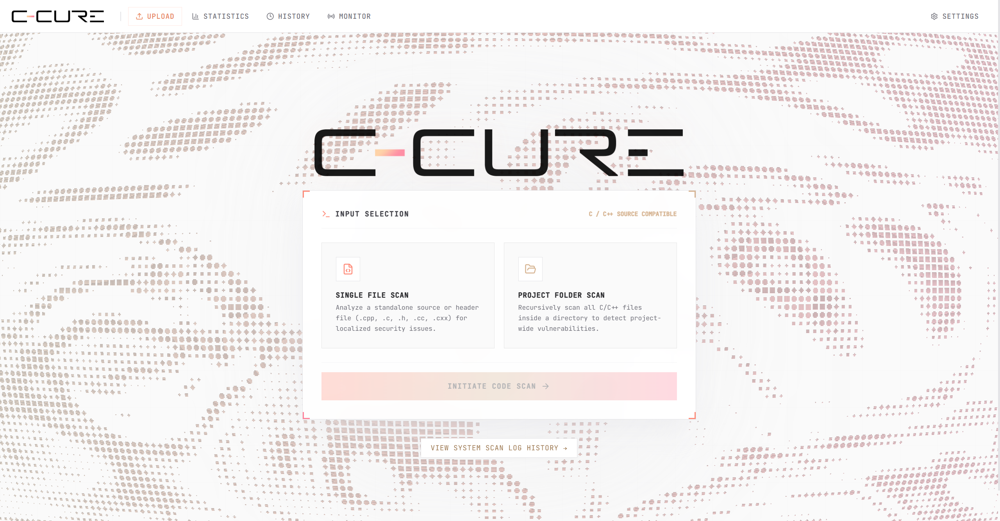

### Real-Time Analysis Progress

Once a target is selected, the analyzing screen displays a five-step progress pipeline: reading source, extracting functions via tree-sitter, connecting to the inference API, running triage and classification, and generating the report. Each step is visually tracked with completion indicators.

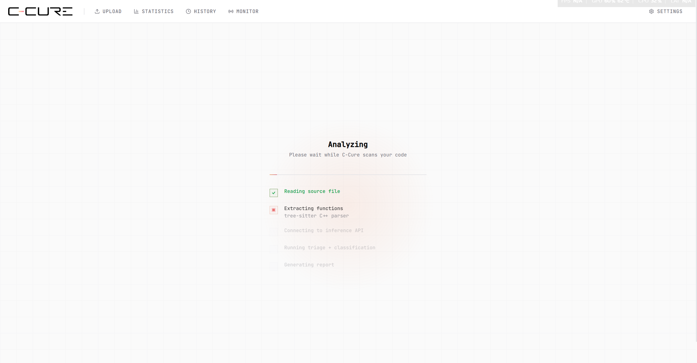

### Granular Function Extraction

The Rust backend uses tree-sitter to parse C++ ASTs and extract individual function definitions and template declarations. Source code is cleaned of comments and normalized before inference, preserving string literals while collapsing whitespace. This function-level granularity reduces noise compared to line-by-line scanners.

### LLM-Powered Inference

Extracted function bodies are dispatched to a configurable remote inference endpoint (Kaggle/NGROK) or a built-in mock provider. The dispatcher uses a Tokio semaphore to run up to 5 concurrent inference tasks per file. Results are mapped to CWE identifiers with confidence scores and severity ratings.

### Interactive Security Dashboard

The statistics page provides a dense, data-rich view of aggregate security posture across all analyses:

- **KPI Cards** — Composite risk score, security health percentage, vulnerability density, total analyses executed, and functions scanned.
- **CWE Vulnerability Topology** — Horizontal bar chart ranking detected weakness types by frequency.
- **Severity Distribution** — Doughnut chart with center metric showing total vulnerable functions, broken down by Critical, High, Medium, and Low.
- **Security Dimension Analysis** — Radar chart assessing defensive posture across Input Validation, Memory Safety, Auth/Session, Crypto, Error Handling, and Logging.
- **Attack Surface Ranking** — Per-file vulnerable/safe ratios for the top 10 most affected files, with a dropdown to drill into specific analyses.
- **Temporal Vulnerability Forensics** — Line chart tracking vulnerability rate and security health over time.
- **Recent Analysis Operations** — Table of latest scans with project name, timestamp, function count, and threat status.

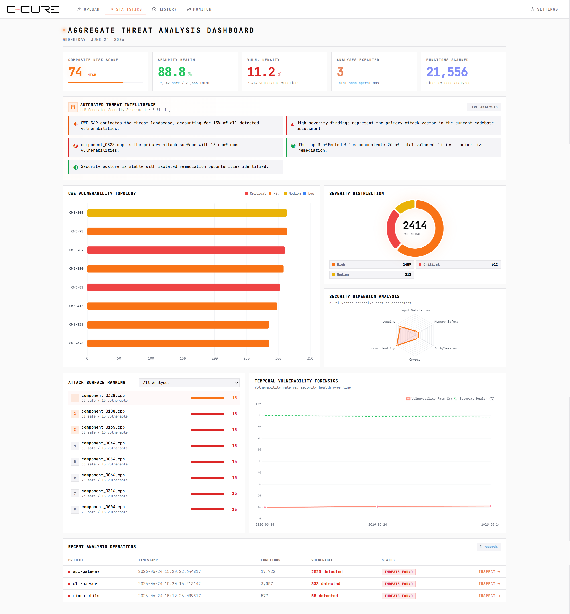

### Analysis History

All scans are persisted locally in DuckDB. The history page lists every past analysis with project name, date, total functions scanned, and vulnerable count. Each row links to its report and can be deleted with inline confirmation. A search bar filters the list by project name.

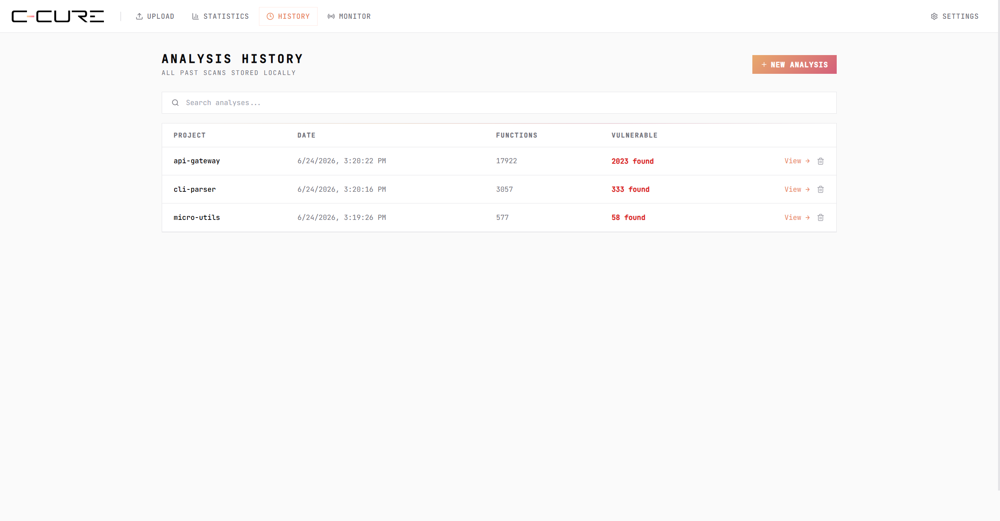

### Report Summary

Every analysis generates a summary report showing:

- **Vulnerability Percentage Ring** — Visual indicator of vulnerable vs. total functions.
- **KPI Cards** — Functions scanned, vulnerable count, clean count, and files scanned.
- **Severity Breakdown** — Horizontal bars for Critical, High, Medium, and Low counts.
- **Top Vulnerabilities** — Ranked list of most frequent CWEs with hit counts.
- **Most Critical Findings** — The highest-severity vulnerable functions with file paths, line ranges, and direct links to the full report.

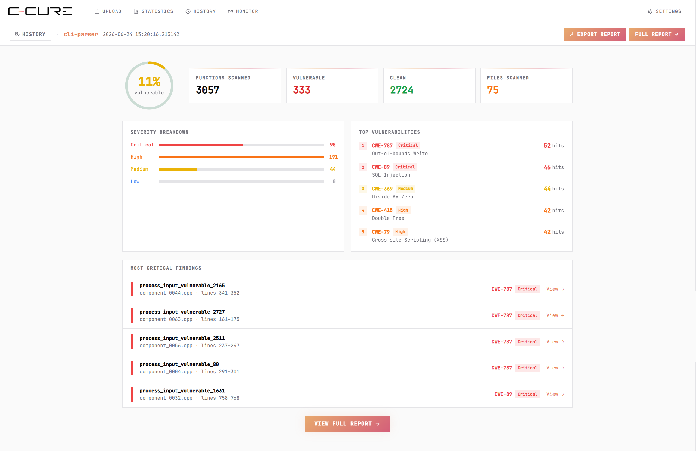

### Detailed Report with Code Review

The full report page provides paginated, searchable, filterable access to every function in the analysis:

- **Search** — Filter by function name, CWE, CWE name, or file path.
- **Verdict Filtering** — Toggle between All, Vulnerable, and Safe.
- **Sorting** — Order by severity, function name, or line number.
- **View Modes** — Flat function list or grouped by source file (auto-detected when the page spans multiple files).
- **Code Display** — Syntax-highlighted C++ with line numbers, generated via highlight.js with theme-aware light/dark styles.
- **CWE Enrichment** — Expanding a vulnerable function reveals its CWE name, CVSS score, CVSS vector, attack scenario, mitigations, and OWASP ASVS compliance badge.
- **Copy to Clipboard** — One-click copy for any function's source code.

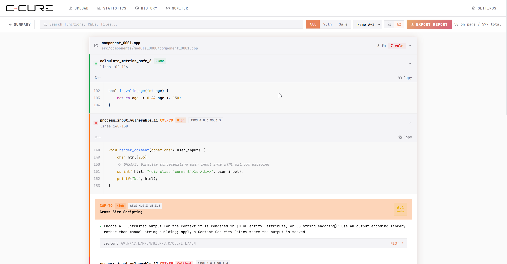

### Real-Time File Monitoring

The monitor page registers project folders for background watching. A recursive `notify` watcher tracks all supported source files. When a file is created or modified, a 500ms debounce triggers a content hash comparison. If the content changed, the file is re-analyzed automatically. Native OS notifications fire for Critical and High severity findings. Each watched folder displays its active status and supported extension list.

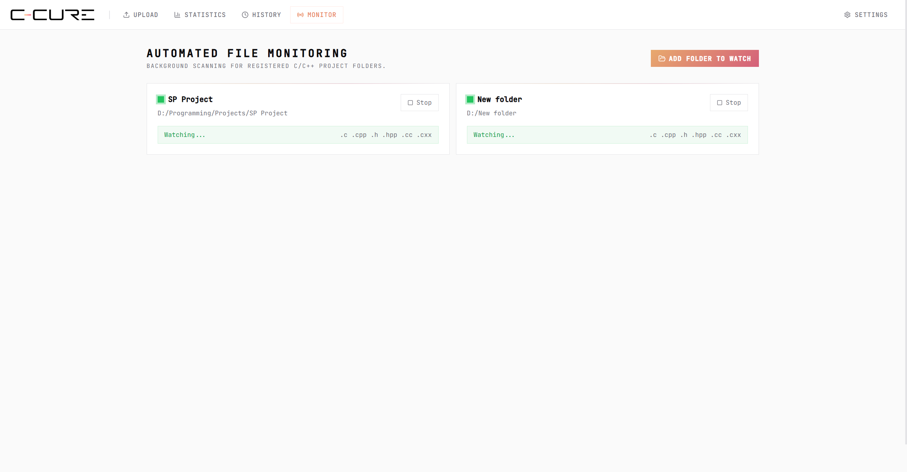

### Multi-Format Export

An export modal attached to every report supports four output formats:

| Format | Description | Options |
|--------|-------------|---------|
| **PDF Technical** | Full detailed findings with function names, file paths, line ranges, CWE IDs, and optional fenced source code blocks. | Max findings (1–1000), include source code snippets |
| **PDF Executive** | High-level summary with stat cards, severity breakdown, top vulnerability types, and top 10 most affected files. No code snippets. | Summary only |
| **SARIF 2.1.0** | Standard static analysis interchange format with tool metadata, CWE-based rules, and per-result locations with code regions. | Full vulnerability details |
| **CSV** | Spreadsheet-ready table with file path, function name, CWE, CWE name, severity, confidence, line numbers, and raw code. | RFC 4180 escaping |

The modal includes a native save dialog for choosing the destination path and displays live export progress via Tauri events.

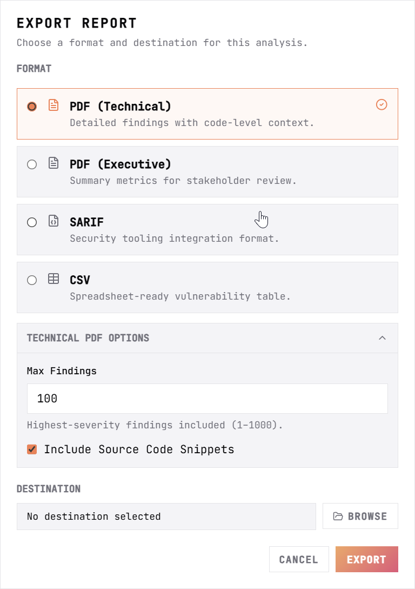

### DuckDB Persistence

All analysis data and monitored projects are stored in a local DuckDB database (`ccure.db`) in the Tauri app data directory. The database supports high-throughput bulk inserts via the DuckDB Appender API.

---

## Architecture

C-Cure is organized into four runtime layers. The **Presentation Layer** (SvelteKit) manages UI state, routing, and visualization. The **Application Layer** (Rust) handles parsing, orchestration, file watching, IPC commands, and native OS integrations. The **Inference Layer** is the remote model endpoint accessed via HTTP. The **Data Layer** persists all state in DuckDB.

### Component Architecture

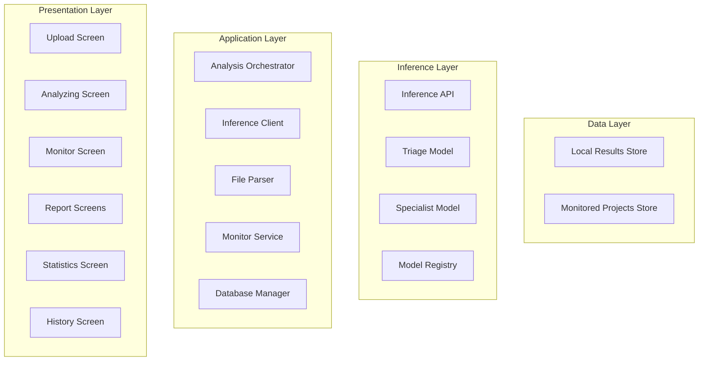


### File/Folder Analysis Pipeline

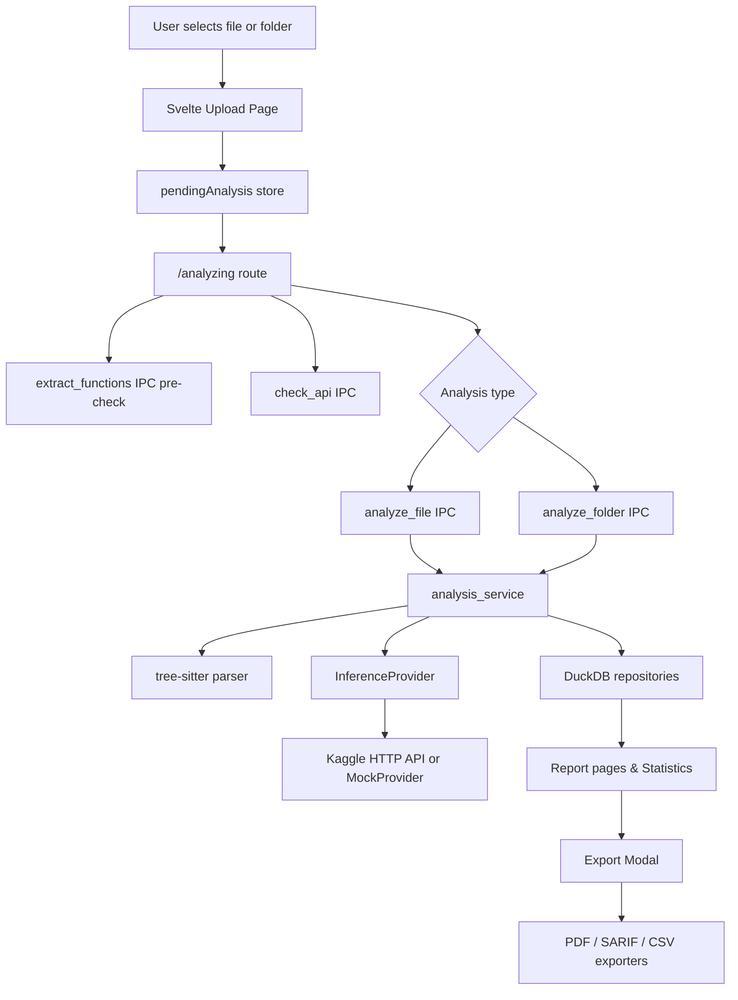

### Real-Time Monitor Pipeline

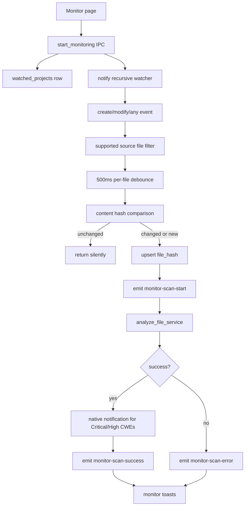

---

## Tech Stack

| Layer | Technology | Purpose |
|-------|------------|---------|
| **Frontend** | Svelte 5 + SvelteKit | Reactive UI, routing, SPA shell |
| **Styling** | Tailwind CSS + CSS Variables | HUD-themed design system, dark/light mode |
| **Visualization** | Chart.js + D3 | Dashboard charts, trend analysis, radar metrics |
| **Desktop Shell** | Tauri v2 | Native window, IPC, OS notifications, file dialogs |
| **Backend** | Rust 2021 + Tokio | Async command handlers, file I/O, concurrency |
| **Parser** | tree-sitter (C++) | AST-based function extraction and source cleanup |
| **Database** | DuckDB (async) | Analytical persistence, OLAP aggregations, appender bulk inserts |
| **PDF Engine** | Typst | Native PDF generation with bundled fonts |
| **HTTP Client** | reqwest | Remote inference communication with configurable TLS |
| **Icons** | lucide-svelte | Consistent iconography across the HUD |

---

## Project Structure

```text
.
├── src/                          # SvelteKit Frontend
│   ├── lib/
│   │   ├── components/           # Shared Svelte components, ExportReportModal, UI primitives
│   │   ├── data/
│   │   │   └── cwe-reference.ts  # Static CWE, CVSS, scenario, and mitigation data
│   │   ├── stores/               # pendingAnalysis, analysis flow, vulnerability count stores
│   │   ├── styles/               # Theme CSS, component classes, buttons, backgrounds
│   │   ├── types/                # TypeScript interfaces, theme store, IPC bindings
│   │   └── utils/                # cn() helper, toast store
│   └── routes/                   # Application pages
│       ├── +page.svelte          # Upload / selection screen
│       ├── analyzing/            # Analysis progress & orchestration
│       ├── history/              # Past analysis history with search & delete
│       ├── statistics/           # Security dashboard with Chart.js
│       ├── monitor/              # Real-time folder monitoring
│       ├── settings/             # Inference URL configuration & theme toggle
│       └── report/[id]/         # Summary & detail report views
├── src-tauri/                    # Rust Backend
│   ├── src/
│   │   ├── main.rs               # Tauri entrypoint
│   │   ├── lib.rs                # AppState, module declarations
│   │   ├── commands.rs           # Full Tauri IPC command surface
│   │   ├── error.rs              # AppError variants & serialization
│   │   ├── parser.rs             # tree-sitter C++ function extraction
│   │   ├── db/                   # DuckDB schema, repositories, migrations
│   │   │   ├── mod.rs            # Pool, schema, migration logic (SQLite -> DuckDB)
│   │   │   ├── analysis_repo.rs  # Analysis CRUD, summaries, reports
│   │   │   ├── stats_repo.rs     # Dashboard aggregations, KPIs, trends
│   │   │   └── projects_repo.rs  # Watched projects & file hash tracking
│   │   ├── inference/            # Inference abstraction layer
│   │   │   ├── mod.rs            # Provider selection (Mock vs Kaggle)
│   │   │   ├── provider.rs       # InferenceProvider trait
│   │   │   ├── kaggle.rs         # HTTP inference provider
│   │   │   ├── mock.rs           # Pattern-based mock provider
│   │   │   ├── dispatcher.rs     # Concurrent Tokio dispatch (max 5)
│   │   │   └── config.rs         # Settings persistence (config.json)
│   │   ├── services/
│   │   │   └── analysis_service.rs # Single-file & folder analysis orchestration
│   │   ├── monitor_service.rs    # File watcher registry, debounce, alerts
│   │   └── exports/              # Report generators
│   │       ├── pdf.rs            # Typst-based technical & executive PDFs
│   │       ├── sarif.rs          # SARIF 2.1.0 JSON export
│   │       └── csv.rs            # CSV export with RFC 4180 escaping
│   └── Cargo.toml                # Rust dependency manifest
├── static/                       # Logos, favicon, framework SVGs, fonts
├── package.json                  # Node scripts & frontend dependencies
├── svelte.config.js              # Static adapter, SPA fallback
├── vite.config.js                # Vite + SvelteKit, port 1420
└── tailwind.config.ts            # Class-based dark mode, accent tokens
```

---

## Vulnerability Coverage

C-Cure maps detected vulnerabilities to **Common Weakness Enumeration (CWE)** identifiers, enriches them with **CVSS** scores, and maps them to **OWASP ASVS** compliance requirements.

| ID | Name | CVSS | Severity | ASVS Mapping |
|----|------|------|----------|--------------|
| **CWE-787** | Out-of-bounds Write | 9.8 | 🔴 Critical | ASVS 4.0.3 V5.4.1 |
| **CWE-89** | SQL Injection | 9.8 | 🔴 Critical | ASVS 4.0.3 V5.3.4 |
| **CWE-125** | Out-of-bounds Read | 9.1 | 🔴 Critical | ASVS 4.0.3 V5.4.1 |
| **CWE-190** | Integer Overflow or Wraparound | 8.6 | 🟠 High | ASVS 4.0.3 V5.4.3 |
| **CWE-415** | Double Free | 8.1 | 🟠 High | ASVS 4.0.3 V5.4.1 |
| **CWE-476** | NULL Pointer Dereference | 7.5 | 🟠 High | ASVS 4.0.3 V5.4.1 |
| **CWE-369** | Divide By Zero | 7.5 | 🟠 High | ASVS 4.0.3 V5.1.4 |
| **CWE-79** | Cross-Site Scripting | 6.1 | 🟡 Medium | ASVS 4.0.3 V5.3.3 |

---

## Workflow

### Manual Analysis
1. **Select Target** — Choose a single C/C++ file (`c`, `cpp`, `h`, `cc`, `cxx`) or an entire project folder.
2. **Pre-Flight Checks** — The frontend verifies function extraction and inference API reachability.
3. **AST Extraction** — Rust backend uses tree-sitter to parse and slice every function definition and template.
4. **Concurrent Inference** — Function bodies are dispatched to the remote LLM endpoint (or mock provider) with up to **5 parallel tasks**.
5. **Persistence** — Results are bulk-saved to DuckDB with file metadata, CWE classifications, severity, and confidence scores.
6. **Reporting** — Navigate to the interactive report for code review, or export to PDF/SARIF/CSV.

### Continuous Monitoring
1. **Register Folder** — Add a project directory to the monitor registry.
2. **Watch** — A recursive `notify` watcher tracks all supported source files.
3. **Detect** — On file creation or modification, a **500ms debounce** triggers a content hash comparison.
4. **Analyze** — If content changed, the file is re-analyzed automatically.
5. **Alert** — Native OS notifications fire for **Critical** and **High** severity findings (CWE-787, CWE-89, CWE-125, CWE-415, CWE-476).

---

## Installation & Development

### Prerequisites

Before building C-Cure, ensure the following tools are installed:

#### All Platforms
- **Node.js 20+**
- **Rust stable toolchain** (`rustup` + Cargo)

#### Windows
- **Visual Studio 2022** (Community or Build Tools)
- **Desktop development with C++** workload
- **Windows 10/11 SDK**

#### Linux
- GCC or Clang
- WebKitGTK development packages (required by Tauri)
- GTK3 development libraries

#### macOS
- Xcode Command Line Tools

#### Inference
- A running inference endpoint (Kaggle / ngrok / custom server), or use the built-in mock provider (`MOCK_API=true`).

### 1. Clone the repository

```bash
git clone https://github.com/LoayElHattab/C-Cure.git
cd C-Cure
```

### 2. Install dependencies

```bash
npm install
```
This installs all frontend dependencies, including the local Tauri CLI used by the project.

### 3. Run the application

```bash
npm run tauri dev
```
On the first launch, Cargo will download and compile all Rust dependencies. This may take several minutes depending on your machine. Subsequent builds are significantly faster due to incremental compilation.
The frontend is served with Vite on `http://localhost:1420` with hot module replacement (HMR) enabled.

### 4. Production build

```bash
npm run build
npm run tauri build
```
The production executable will be generated under:
```
src-tauri/target/release/
```

### 5. Configure the inference provider

After launching the application:

1. Open **Settings**.
2. Enter the base URL of your inference API.
3. Save the configuration.

For offline development, start the application with the mock provider:

```bash
MOCK_API=true npm run tauri dev
```

---

## Testing

### Rust Unit Tests
Run backend tests with Cargo:
```bash
cd src-tauri
cargo test
```

**Covered modules:**
- `parser.rs` — Comment cleaning, string preservation, function & template extraction
- `monitor_service.rs` — Source file filtering, case-insensitive extension matching
- `exports/pdf.rs` — Typst code block handling, max findings truncation, file creation
- `exports/csv.rs` — Quote, comma, and newline escaping

---

## License

This project is licensed under the **MIT License**. See [LICENSE](LICENSE) for details.

---
